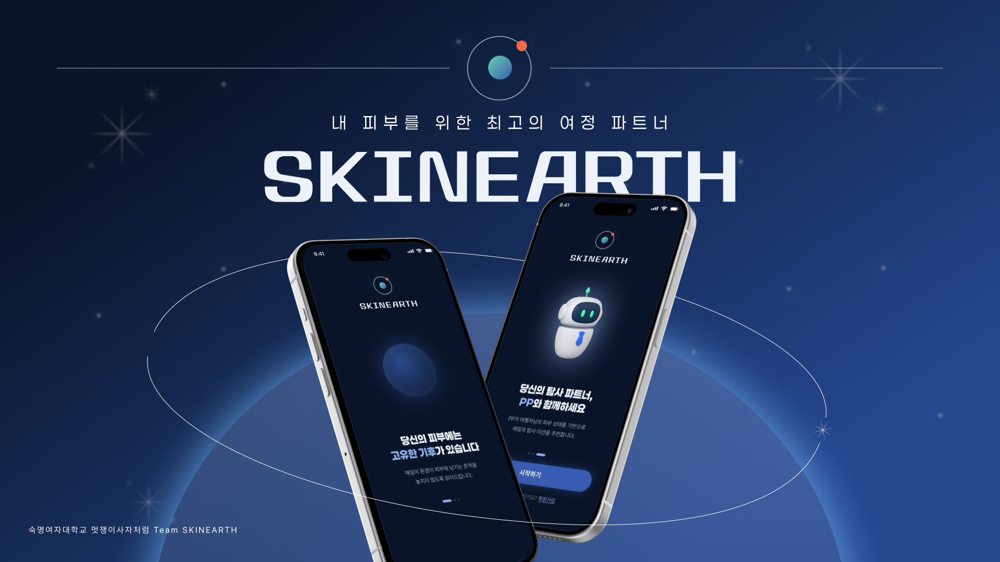

# 스킨어스 SKINEARTH

## 🌍 ABOUT SKINEARTH
- 프로젝트 한 줄 소개
- 개발 배경 / 문제 정의
- 프로젝트 목표

## 📖 OVERVIEW
- 핵심 기능
- 사용자 이용 흐름
- 주요 화면

## 👤 Members
| PM | FE | FE | BE | BE |
| :---: | :---: | :---: | :---: | :---: |
|  |  |  |  |  |
| 박수현 | 박서현 | 박영서 | 강지윤 | 박수빈 |
| - | 로그인 페이지 회원가입 페이지 온보딩 페이지 홈 페이지 히스토리 페이지 | 스플래시 페이지 기록 페이지 예보 페이지 미션 페이지 마이페이지 | - | - |

## 🛠 TECH STACK
<h3 align="center">Frontend</h3>

  
  
  
   
  

<h3 align="center">Backend</h3>

  
  
  
   
  

<h3 align="center">AI</h3>

  

<h3 align="center">Database</h3>

  

<h3 align="center">Infra / Deployment</h3>

  
  

<h3 align="center">Tools</h3>

  
  
  

## 📌 Features
### 기록
### 피부 컨디션 예보
### 미션
### 사용자 관리

## 📁 PROJECT STRUCTURE
### Frontend
### Backend

## 🚀 DEPLOYMENT
### Service URL

> SKINEARTH 
> https://skinearth.vercel.app 

## 📚 WORKSPACE

- 📝 **Notion** — [SKINEARTH Workspace](https://daisy-licorice-73f.notion.site/likelion-skinearth?pvs=74)
- 📑 **Swagger** — [SKINEARTH API Documentation](https://skinearth-api.up.railway.app/swagger-ui/index.html#/)
